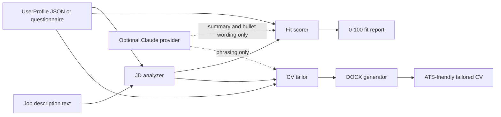

# cv-builder

Build an ATS-ready CV, score it against any job description, and tailor the CV to that role - all from a Python CLI.

`cv-builder` started as an interactive CV builder with role recommendations. Version 2 adds a JD-aware workflow for real applications: paste a job description, get a deterministic fit score, then generate a tailored `.docx` CV without sending your profile anywhere. If you choose to install the optional Claude dependency and set an API key, the same workflow can enrich summary and bullet phrasing while keeping the scoring deterministic.

## What it does

- Creates CVs from a structured `UserProfile` using the existing interactive questionnaire.
- Parses job descriptions into titles, keywords, requirements, and years of experience.
- Scores profile fit from 0-100 with a weighted breakdown:
  - Skills match: 40
  - Experience relevance: 30
  - ATS keywords: 20
  - Structural fit: 10
- Tailors a CV to the JD by reordering skills, bullets, and projects without fabricating claims.
- Generates ATS-friendly single-column `.docx` output with `python-docx`.
- Keeps PDF and plain-text CV generation as secondary output options.
- Runs offline by default; the optional Claude path activates only when configured.

## Quickstart

```bash
python -m venv .venv
.venv\Scripts\activate
pip install -e ".[dev]"
cv-builder demo
```

On macOS/Linux:

```bash
python -m venv .venv
source .venv/bin/activate
pip install -e ".[dev]"
cv-builder demo
```

The demo uses:

- `cv_builder/sample_data/sample_profile.json`
- `cv_builder/sample_data/sample_jd.txt`

It prints a fit score, shows a tailoring change-log, and writes a tailored DOCX into a demo output folder.

## CLI usage

Run the interactive builder:

```bash
cv-builder
```

Score a saved profile against a JD:

```bash
cv-builder score --profile profile.json --jd job-description.txt
```

Tailor a saved profile and generate a `.docx` CV:

```bash
cv-builder tailor --profile profile.json --jd job-description.txt -o output
```

Run the offline sample demo:

```bash
cv-builder demo
```

## Optional Claude enrichment

The base install has zero AI/API dependencies. To enable optional Claude enrichment:

```bash
pip install -e ".[ai]"
set ANTHROPIC_API_KEY=your_key_here
```

PowerShell:

```powershell
$env:ANTHROPIC_API_KEY = "your_key_here"
```

The deterministic scorer still owns the numbers. Claude is only used to improve prose summaries or bullet phrasing, and failures fall back silently to the offline result.

You can override the default model with:

```bash
set CV_BUILDER_CLAUDE_MODEL=your_model_name
```

## Architecture



## Development

Install the development extras:

```bash
pip install -e ".[dev]"
```

Run tests and linting:

```bash
pytest
ruff check .
```

## Public sample profile

The included sample profile is intentionally privacy-safe. It uses a realistic public portfolio story while keeping email and phone values as placeholders so the repository can remain public.
